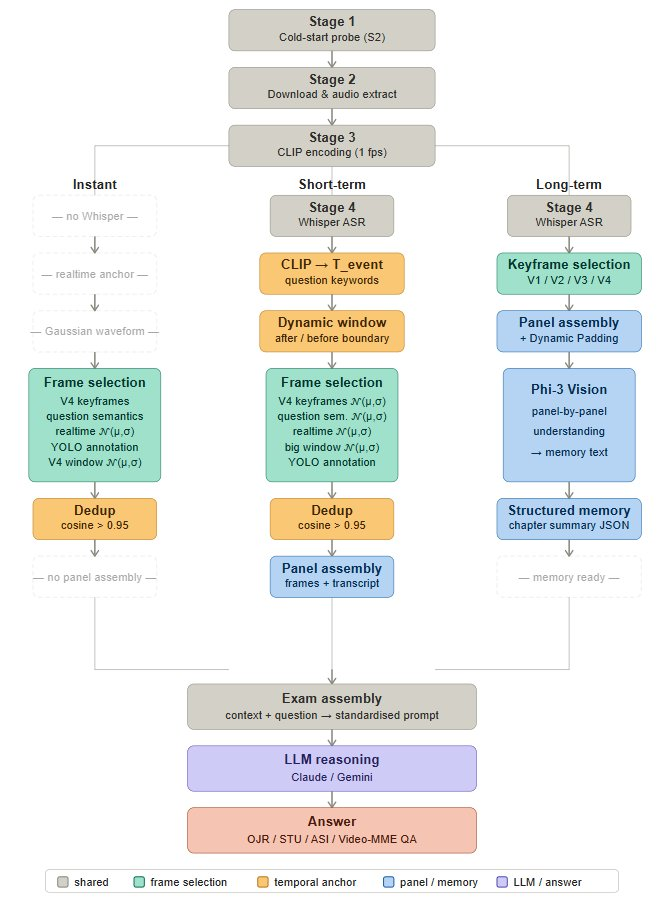
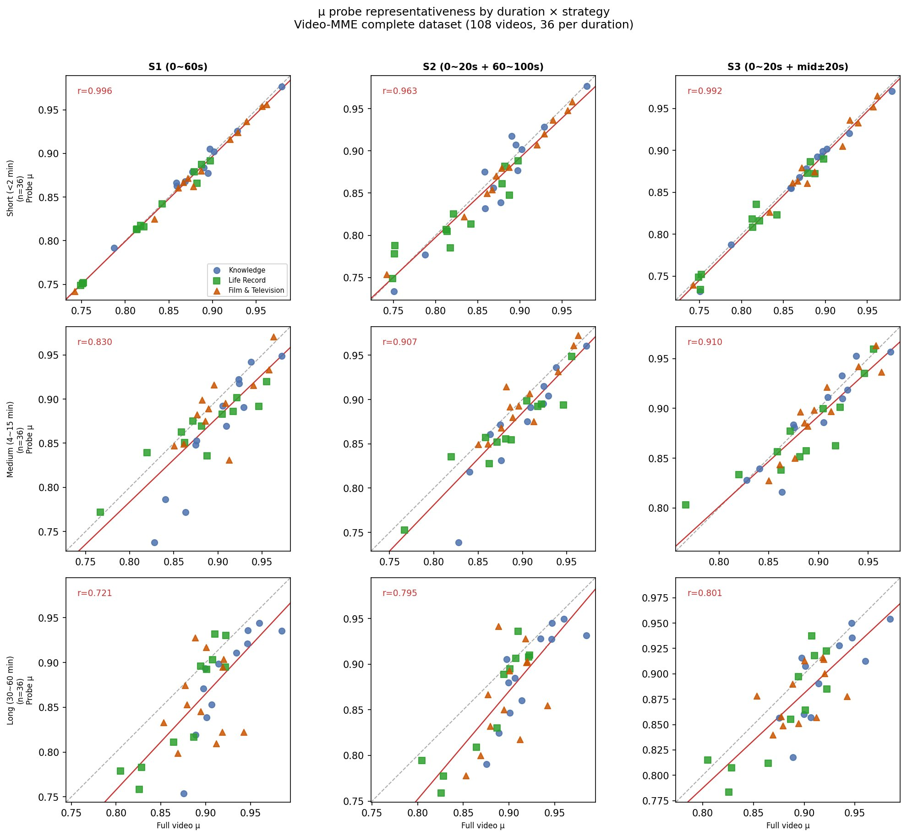
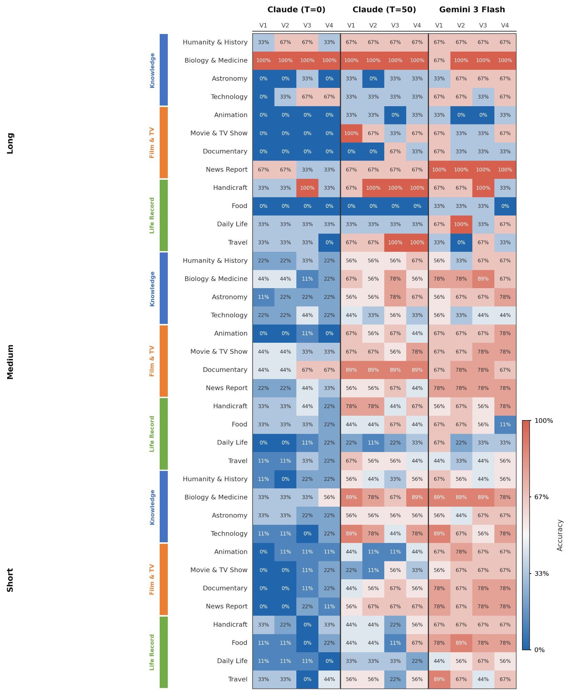
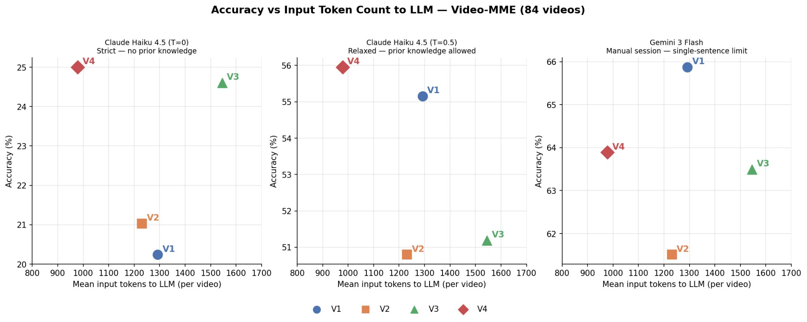

# Comic Book Hypothesis (CBH)
### A Training-Free Framework for Streaming Video Narrative Understanding

[](https://opensource.org/licenses/MIT)
[](./paper/cbh_v1.pdf)
[]()
[](https://doi.org/10.5281/zenodo.20111446)

> 
>
> This research was developed and tested collaboratively by an independent researcher from outside the field and Claude Sonnet 4.6, without institutional affiliation. All development and experiments were conducted on Google Colab T4/A100.

> **Part 1 of a 3-paper series** on sparse video understanding.
> - Part 1 (this repo): Keyframe distillation — *CBH*
> - Part 2: Multi-source superposition architecture — [`video-understanding-superposition`](https://github.com/cjlee/video-understanding-superposition)
> - Part 3: Harness framework — [`video-understanding-harness`](https://github.com/cjlee/video-understanding-harness)

---

## 核心概念 / Core Idea

**中文**

連續影片中，真正承載敘事突變的關鍵時刻只佔少數。CBH 將影片蒸餾成稀疏的「漫畫格」——每格由一張關鍵幀截圖與對應時段的 ASR 逐字稿組成——讓通用 LLM 在**完全不需要重新訓練**的條件下進行影片敘事推理，可在消費級 GPU 上運行（短片/中片：T4 16GB；長片：A100 40GB）。

**English**

Most frames in a video carry no narrative change. CBH distills continuous video into sparse *comic panels* — each panel is a keyframe screenshot paired with its ASR transcript — enabling general-purpose LLMs to reason about video narratives with **zero model training**, running on consumer-grade GPUs (short/medium videos: T4 16GB; long videos: A100 40GB).

---

## 系統架構 / System Architecture

**共同前段 / Shared pipeline:**
```
Stage 1: Video download & audio extract   ← yt-dlp + ffmpeg
Stage 2: Cold-start probe (S2)            ← 100 frames → μ, σ, autocorr
Stage 3: CLIP encoding (1 fps)            ← ViT-B/32 + keyframe selection (V1/V2/V3/V4)
Stage 4: Whisper ASR transcription        ← timestamped transcript
Stage 5: Comic panel assembly             ← keyframe + transcript + Dynamic Padding
```

**下游分兩條路徑 / Two downstream paths:**
```
Path A (Instant / Short-term)             Path B (Long-term memory)
─────────────────────────────             ────────────────────────────────────
Comic panels                              Stage 6: Phi-3 Vision understanding
    ↓                                         ↓ panel-by-panel memory text
LLM directly                             Stage 6+: Gemini compression
(Claude / Gemini)                             ↓ structured chapter summary
                                         Stage 7: LLM reasoning & answer
```

- **Path A** skips Phi-3 entirely — comic panel images are sent directly to the LLM. Used for instant perception and short-term memory tasks.
- **Path B** compresses panels through Phi-3 Vision → Gemini, producing a structured memory JSON before LLM reasoning. Used for long-term memory tasks (Video-MME).



---

## Stage 2 Optimization: Cold-Start Probe

串流場景下，系統在開始時對全片視覺節奏一無所知。S2 探針取前 100 幀（0–20s + 60–100s）估計全片特徵，並以 OLS 線性校正補償系統性偏差：

In streaming scenarios, the system has no prior knowledge of the video's visual rhythm. The S2 probe samples 100 frames (0–20s + 60–100s) to estimate full-video statistics, corrected via OLS regression:

```
μ̂_full = 0.8076 × S2_μ + 0.1839   (R² = 0.775)
σ̂_full = 0.7533 × S2_σ + 0.0178   (R² = 0.603)
```

Validated on 108 Video-MME videos: S2 achieves μ representativeness r = 0.880, outperforming S1 (r = 0.842) while requiring no prior knowledge of video duration — the only probe strategy viable for live streaming.

| Strategy | Window | Viable for streaming? |
|----------|--------|-----------------------|
| S1 | 0–60s | ⚠️ poor on long videos |
| **S2** | 0–20s + 60–100s | ✅ recommended |
| S3 | 0–20s + mid±20s | ❌ requires total duration |



---

## Stage 3 Optimization: Keyframe Selection

標準 K-means 的根本缺陷是 cluster 中心固定——同一場景反覆出現只會被選一次，重要的敘事時刻因此被遺漏。V4（TDC）以指數衰減半徑解決此問題：

Standard K-means has a fundamental failure on repeated-scene videos: fixed cluster centers mean a recurring scene is captured only once. V4 (TDC) solves this with an exponentially decaying cluster radius:

```
r(t) = r₀ · exp(−λ · (t − t_born))
r₀ = μ + kσ,   λ = β · (1 − ρ) / T     (k=0.3, β=1)
```

當新幀與所有現有 cluster 的距離均超過其當前半徑時，判定為新語意區域並選為關鍵幀。autocorr（ρ）高時衰減快，允許重複場景被重新捕捉；autocorr 低時衰減慢，避免過度選幀。V4 只使用過去資訊，為純 online 方法。

When a new frame exceeds the current radius of all existing clusters, it is selected as a keyframe and a new cluster is created. High autocorr (ρ) → fast decay → repeated scenes get re-selected; low autocorr → slow decay → avoids over-sampling. V4 is purely online, using only past information.

| Method | Description | Online | Key Formula |
|--------|-------------|--------|-------------|
| V1 | Adjacent cosine threshold | ✅ | `θ = μ + kσ, k=0.3` |
| V2 | Causal intersection with temporal tolerance | ❌ | cosine spike ∧ drift confirmed within δs |
| V3 | Transcript-only baseline (10s segments) | ✅ | — |
| **V4 (TDC)** | Temporal Decay Clustering | ✅ | `r(t) = r₀·exp(−λ(t−t_born))` |

---

## Query-Time Frame Selection (Path A)

長期記憶（Path B）在離線階段就已完成選幀與壓縮。即時感知與短期記憶（Path A）則在查詢時動態選幀，根據問題性質採用不同的錨點與取樣策略。

For long-term memory (Path B), frame selection is completed offline. Instant perception and short-term memory (Path A) select frames dynamically at query time, using different anchors and sampling strategies depending on the question type.

### Instant Perception（即時感知）

錨點為 `realtime`——問題發生的當下時間點。以四個來源建立複合高斯取樣波形：

Anchor: `realtime` — the moment the question occurs. Four sources build a composite Gaussian sampling waveform:

| Source | Description |
|--------|-------------|
| A — V4 keyframe window | Bilateral Gaussian around the nearest V4 keyframe before realtime |
| B — Realtime window | Unilateral Gaussian looking backward from realtime (window=5s, σ=1.5s) |
| C — CLIP semantic retrieval | Top-2 frames most semantically similar to the question text |
| D — YOLO annotation | Raw frame + YOLOv8n object detection + pose estimation at realtime |

### Short-term Memory（短期記憶）

短期記憶問題的形式為「某件事之後/之前發生了什麼？」，需要先定位事件錨點，再動態展開窗口。

Short-term memory questions ask "what happened after/before event X?" — requiring event localization before window expansion.

**Step 1 — T_event localization:** spaCy extracts nouns and verbs from the question; CLIP encodes them as a query vector and searches the full frame sequence for the most semantically similar timestamp.

**Step 2 — Dynamic window:** Direction word (after/before) determines the main direction. `find_window_boundary()` finds the 5th V4 keyframe or semantic frame in the main direction from T_event, whichever is farther, as the window boundary; 1 frame in the opposite direction.

**Step 3 — Five-source sampling:**

| Source | Description |
|--------|-------------|
| A — V4 keyframes | All V4 keyframes within the dynamic window, each with bilateral Gaussian |
| B — Realtime window | Unilateral Gaussian looking backward from realtime |
| C — Question semantics | CLIP top-3 frames within the window, each with bilateral Gaussian |
| D — Big window sparse | Sparse Gaussian centered on T_event covering the full dynamic window (20 frames, min 0.5s spacing) |
| E — YOLO annotation | One YOLO-annotated frame each at T_event and realtime |

問題語意（來源 C）在短期記憶任務的貢獻度（27.1%）遠高於即時感知任務（5.8%），印證短期記憶需要在較長時間窗口內定位特定事件，語意引導取樣因此更為關鍵。

Source C (question semantics) contributes 27.1% in short-term memory vs. only 5.8% in instant perception — confirming that semantic-guided sampling is critical when the answer lies within a longer temporal window.

---

## 實驗結果 / Results

### Long-term Memory — Video-MME (84 videos, 252 questions)

三種 LLM 設定刻意設計為不同程度的資訊限制，用來分離蒸餾記憶品質與 LLM 自身推理能力的貢獻：

Three LLM configurations are deliberately designed with different levels of information restriction, to separate the contribution of distillation memory quality from the LLM's own reasoning ability:

- **Claude T=0** — API call, temperature=0, prompt explicitly forbids use of internal knowledge; answers X when information is insufficient. Strictest condition.
- **Claude T=0.5** — API call, temperature=0.5, allows and encourages use of internal knowledge and reasoning. Relaxed condition.
- **Gemini 3 Flash** — Manual chat interface, single-sentence restriction "answer only based on the exam content", no API control.

**Short (≤2 min, 36 videos)**

| Method | Claude T=0 | Claude T=0.5 | Gemini 3 Flash | Avg tokens |
|--------|-----------|--------------|----------------|------------|
| V1 | 14.8% | 52.8% | 71.3% | 1292 |
| V2 | 13.9% | 48.1% | 67.6% | 1231 |
| V3 | 12.0% | 40.7% | 66.7% | 1545 |
| **V4** | **24.1%** | **56.5%** | **69.4%** | **978** |

**Medium (4–15 min, 36 videos)**

| Method | Claude T=0 | Claude T=0.5 | Gemini 3 Flash | Avg tokens |
|--------|-----------|--------------|----------------|------------|
| V1 | 24.1% | 59.3% | 63.0% | 1292 |
| V2 | 25.0% | 54.6% | 57.4% | 1231 |
| V3 | 32.4% | 61.1% | 63.0% | 1545 |
| **V4** | **25.9%** | **55.6%** | **61.1%** | **978** |

**Long (30–60 min, 12 videos)**

| Method | Claude T=0 | Claude T=0.5 | Gemini 3 Flash | Avg tokens |
|--------|-----------|--------------|----------------|------------|
| V1 | 25.0% | 50.0% | 58.3% | 1292 |
| V2 | 30.6% | 47.2% | 55.6% | 1231 |
| V3 | **38.9%** | 52.8% | 55.6% | 1545 |
| **V4** | 25.0% | **55.6%** | **55.6%** | **978** |

**Overall (84 videos)**

| Method | Claude T=0 | Claude T=0.5 | Gemini 3 Flash | Avg tokens |
|--------|-----------|--------------|----------------|------------|
| V1 | 20.2% | 55.2% | 65.9% | 1292 |
| V2 | 21.0% | 50.8% | 61.5% | 1231 |
| V3 | 24.6% | 51.2% | 63.5% | 1545 |
| **V4** | **25.0%** | **56.0%** | **63.9%** | **978** |

V4 achieves the highest overall accuracy under strict conditions (T=0) with the fewest tokens (978 vs 1545 for V3). Notably, V3 (transcript-only) outperforms visual methods on long videos under T=0 — pure transcripts carry higher information density for extended content. V4 dominates on short videos across all LLM settings.





### Instant Perception — OVO-Bench Gaming (43 questions)

| Model | Type | OJR | STU |
|-------|------|-----|-----|
| Human Agents | Human | 94.02% | 92.70% |
| GPT-4o | Proprietary Offline | 59.78% | 51.12% |
| Gemini 1.5 Pro | Proprietary Offline | 61.96% | 58.43% |
| Qwen2-VL-72B | Open-source Offline | 54.35% | 51.69% |
| LLaVA-Video-7B | Open-source Offline | 59.78% | 49.44% |
| Flash-VStream-7B | Open-source Online | 28.80% | 33.71% |
| VideoLLM-online-8B | Open-source Online | 21.20% | 14.04% |
| **CBH (Ours)** | **Training-free** | **65.0%** | 40.9% |

OJR surpasses all published offline fixed-frame models. STU near chance level (25%) — identified as a systematic bottleneck of sparse keyframe representation.

*Leaderboard source: [OVO-Bench](https://joeleelyf.github.io/OVO-Bench/)*

### Short-term Memory — OVO-Bench ASI (76 questions)

| Model | Type | ASI |
|-------|------|-----|
| Human Agents | Human | 93.02% |
| GPT-4o | Proprietary Offline | 75.68% |
| Gemini 1.5 Pro | Proprietary Offline | 76.35% |
| Qwen2-VL-72B | Open-source Offline | 60.81% |
| LongVU-7B | Open-source Offline | 59.46% |
| LLaVA-Video-7B | Open-source Offline | 57.43% |
| InternVL2-8B | Open-source Offline | 57.43% |
| LLaVA-OneVision-7B | Open-source Offline | 55.41% |
| Flash-VStream-7B | Open-source Online | 37.16% |
| VideoLLM-online-8B | Open-source Online | 18.80% |
| **CBH (Ours)** | **Training-free** | **61.8%** |

CBH surpasses all open-source offline and online models on ASI backward tracing.

*Leaderboard source: [OVO-Bench](https://joeleelyf.github.io/OVO-Bench/)*

---

## 安裝與使用 / Installation & Usage

三條路徑對應三種任務，各自有獨立的執行腳本。`pipeline_core.py` 是長期記憶路徑的核心函數庫；即時感知和短期記憶路徑為自包含腳本，不依賴 `pipeline_core.py`。

Three paths correspond to three task types, each with its own script. `pipeline_core.py` is the core library for the long-term memory path only; instant and short-term paths are self-contained scripts.

---

### 共用套件安裝 / Common dependencies

```bash
pip install yt-dlp scipy
pip install git+https://github.com/openai/CLIP.git

# Linux
apt-get install -y ffmpeg
# macOS
# brew install ffmpeg
```

---

### Path B — Long-term Memory（長期記憶）
**Script:** `run.py` + `pipeline_core.py` | **Benchmark:** Video-MME

```bash
pip install openai-whisper transformers==4.44.0 accelerate

python run.py "https://www.youtube.com/watch?v=YOUR_VIDEO_ID" \
    --label my_video \
    --video-id 001 \
    --methods v1,v2,v3,v4 \
    --gemini-key YOUR_GEMINI_API_KEY   # 選填，產生長期記憶 JSON
```

---

### Path A — Instant Perception（即時感知）
**Script:** `run_instant.py` | **Benchmark:** OVO-Bench Gaming (OJR / STU)

```bash
pip install ultralytics spacy anthropic
python -m spacy download en_core_web_sm

export ANTHROPIC_API_KEY=YOUR_KEY
python run_instant.py \
    --youtube-id lhL3SUb078g \
    --video-list video_list.json
```

---

### Path A — Short-term Memory（短期記憶）
**Script:** `run_stm.py` | **Benchmark:** OVO-Bench ASI

```bash
pip install ultralytics spacy anthropic openai-whisper matplotlib
python -m spacy download en_core_web_sm

export ANTHROPIC_API_KEY=YOUR_KEY
python run_stm.py \
    --youtube-id fFjv93ACGo8 \
    --video-list video_list.json
```

---

> ⚠️ **API Key 安全提醒 / API Key Security**
> 請勿將 API key 直接寫入程式碼後上傳到公開 repo。
> Never hardcode API keys before pushing to a public repository.
> 建議使用環境變數：`export ANTHROPIC_API_KEY=YOUR_KEY`

**Hardware:** T4 (16GB) for short/medium videos; A100 (40GB) recommended for long videos (>30 min) due to Phi-3 memory requirements.

---

## 檔案結構 / Repository Structure

```
video-understanding-CBH/
├── pipeline_core.py                  # Core library for long-term memory path
├── run.py                            # Path B: Long-term memory
├── run_instant.py                    # Path A: Instant perception
├── run_stm.py                        # Path A: Short-term memory
├── paper/
│   └── placeholder.txt               # Paper coming soon
├── results/
│   ├── probe_results.csv             # Cold-start probe data (108 videos)
│   └── figures/                      # All paper figures
└── README.md
```

---

## 引用 / Citation

```bibtex
@software{lee2026cbh,
  title   = {Comic Book Hypothesis: A Training-Free Framework for Streaming Video Narrative Understanding},
  author  = {Lee, C.J.},
  year    = {2026},
  doi     = {10.5281/zenodo.20111446},
  url     = {https://github.com/cjlee/video-understanding-CBH}
}
```
